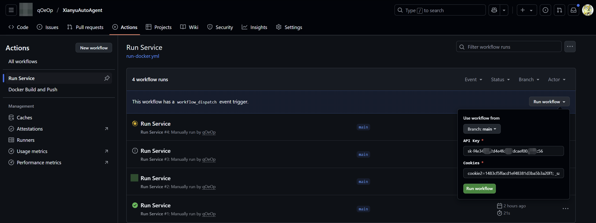

# 🚀 Xianyu AutoAgent - 智能闲鱼客服机器人系统

[](https://www.python.org/) [](https://platform.openai.com/)

专为闲鱼平台打造的AI值守解决方案，实现闲鱼平台7×24小时自动化值守，支持多专家协同决策、智能议价和上下文感知对话。

## 🎮 Playground - 快速体验（免配置版）

无需本地环境或设置 Secrets！**直接通过 GitHub Actions 网页端传入参数**，一键启动闲鱼机器人。

### 如何使用
1. **Fork 本仓库** → 点击右上角 `Fork` 按钮
2. **触发 Action**：
   - 进入你的仓库 `Actions` 标签页
   - 选择 **`🚀 Run Service`** 工作流
   - 点击 **`Run workflow`** 按钮，填写参数：
      - `API Key`: 粘贴你的大模型 API Key（如阿里云 DashScope）
      - `Cookies`: 粘贴闲鱼网页端的完整 Cookie 字符串
3. **查看运行日志**：
   - 机器人启动后会自动监听闲鱼消息
   - 在 Action 日志中搜索 `🤖 Reply:` 查看对话记录

### 注意事项
⚠️ 注意临时运行限制：
- 默认运行 **30分钟**（GitHub 免费账户限制）
- 敏感信息（如 Cookie）**不会存储**，仅当次生效

<div align="center">
  
</div>

## 🌟 核心特性

### 智能对话引擎
| 功能模块   | 技术实现            | 关键特性                                                     |
| ---------- | ------------------- | ------------------------------------------------------------ |
| 上下文感知 | 会话历史存储        | 轻量级对话记忆管理，完整对话历史作为LLM上下文输入            |
| 专家路由   | LLM prompt+规则路由 | 基于提示工程的意图识别 → 专家Agent动态分发，支持议价/技术/客服多场景切换 |

### 业务功能矩阵
| 模块     | 已实现                        | 规划中                     |
| -------- | ----------------------------- | ----------------------- |
| 核心引擎 | ✅ LLM自动回复<br>✅ 上下文管理 | 🔄 情感分析增强               |
| 议价系统 | ✅ 阶梯降价策略                | 🔄 市场比价功能               |
| 技术支持 | ✅ 网络搜索整合                | 🔄 RAG知识库增强             |

## 🚴 快速开始

### 环境要求
- JDK 21+
- Maven 3.9.10+

### 安装步骤
```bash
1. 克隆仓库
git clone https://github.com/qOeOp/XianyuAutoAgent.git
cd XianyuAutoAgent

2. 配置环境变量
- AI_DASHSCOPE_API_KEY : 阿里云大模型API-KEY
- COOKIES_STR : 闲鱼网页端Cookie

3. 执行命令
mvn spring-boot:run
注意：默认使用的模型是通义千问，如需使用其他API，请自行修改application.yml文件中的模型地址和模型名称；
COOKIES_STR自行在闲鱼网页端获取cookies(网页端F12打开控制台，选择Network，点击Fetch/XHR,点击一个请求，查看cookies)

4. (可选)创建提示词文件src/main/resources/prompt-config.txt
```

## 🤝 参与贡献

欢迎通过 Issue 提交建议或 PR 贡献代码，请遵循 [贡献指南](https://contributing.md/)


## 🛡 注意事项

⚠️ 注意：**本项目仅供学习与交流，如有侵权联系作者删除。**

鉴于项目的特殊性，开发团队可能在任何时间**停止更新**或**删除项目**。


## 🧸 特别鸣谢

本项目基于以下开源项目重构：
- [XianyuAutoAgent](https://github.com/shaxiu/XianyuAutoAgent) - 智能闲鱼客服机器人系统，由 [@shaxiu](https://github.com/shaxiu) 和 [@cv-cat](https://github.com/cv-cat) 开发